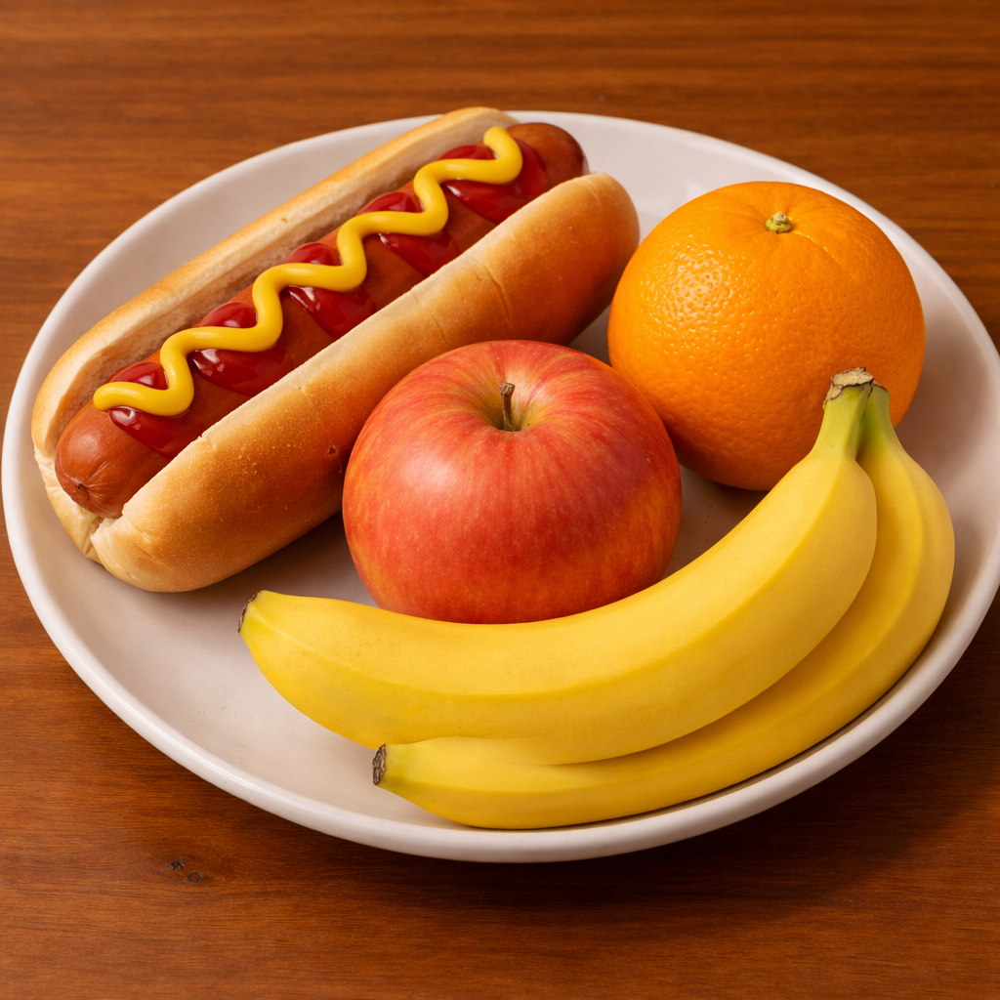
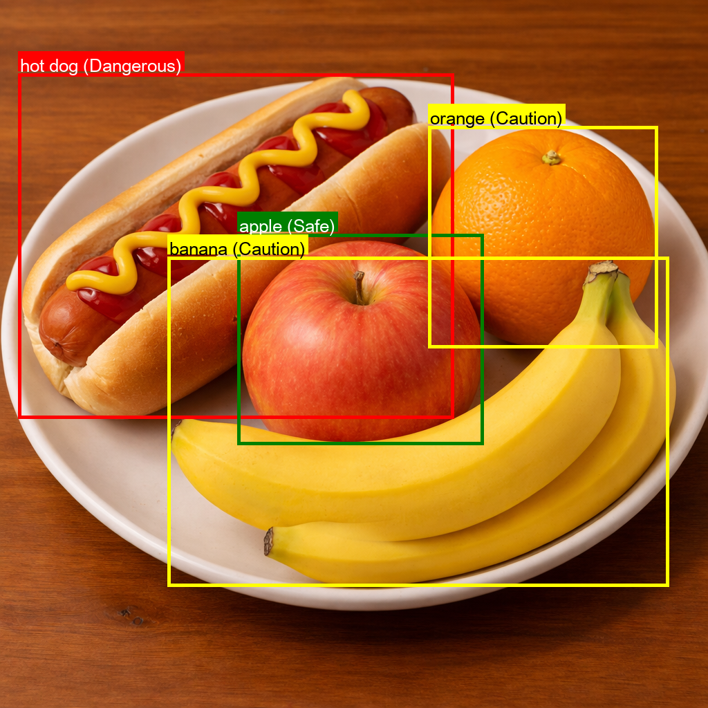

# 🍎 Diabetes Food Risk Detection

이미지 속 음식을 인식하고 당뇨 환자에게 위험한 음식인지 판단하는 AI 프로젝트입니다.

Object Detection 모델(DETR)을 활용해 음식 객체를 탐지하고,
탐지된 음식에 대해 당뇨 환자 기준 위험도를 분류합니다.

---

# 📷 Demo
(데모 이미지는 OpenAI의 ChatGPT 기반 이미지 생성 기능을 활용해 제작되었습니다.)

## Input Image



## Detection Result



---

# ⚙️ Features

* 이미지 속 음식 자동 탐지
* 음식 종류 기반 위험도 분류
* 위험도에 따른 색상 표시

| Risk Level   | Meaning        |
| ------------ | -------------- |
| 🔴 Dangerous | 당뇨 환자에게 위험한 음식 |
| 🟡 Caution   | 섭취 주의          |
| 🟢 Safe      | 비교적 안전         |

---

# 🧠 Model

Object Detection 모델

* **Model:** DETR (DEtection TRansformer)
* **Backbone:** ResNet-50
* **Pretrained Model:** facebook/detr-resnet-50
* **Framework:** PyTorch
* **Library:** HuggingFace Transformers

---

# 🛠 Tech Stack

* Python
* PyTorch
* HuggingFace Transformers
* PIL
* Matplotlib

---

# 📂 Project Structure

```
diabetes-food-detection
│
├── main.py           # 실행 파일
├── model.py          # 음식 탐지, 위험성 시각화 모델
├── requirements.txt
├── README.md
│
├── sample_images       # 입력 이미지
│   └── test1.png
│
└── images      # 결과 이미지
    └── result_example.png
```

---

# 🚀 How to Run

### 1️⃣ Install dependencies

pip install -r requirements.txt

### 2️⃣ Run the program

python main.py

### 3️⃣ Result

모델이 음식 객체를 탐지하고 위험도를 표시한 이미지가 생성됩니다.

결과 이미지 경로

diabetes/images/result_example.png

---

# 📊 Example Detection

| Food   | Risk      |
| ------ | --------- |
| Pizza  | Dangerous |
| Cake   | Dangerous |
| Banana | Caution   |
| Apple  | Safe      |

---

# 🔎 Future Improvements

* 더 많은 음식 데이터셋 학습
* 당뇨 영양 기준 기반 위험도 계산
* 모바일 앱 연동
* 실시간 카메라 인식

---

# 📜 License

MIT License
